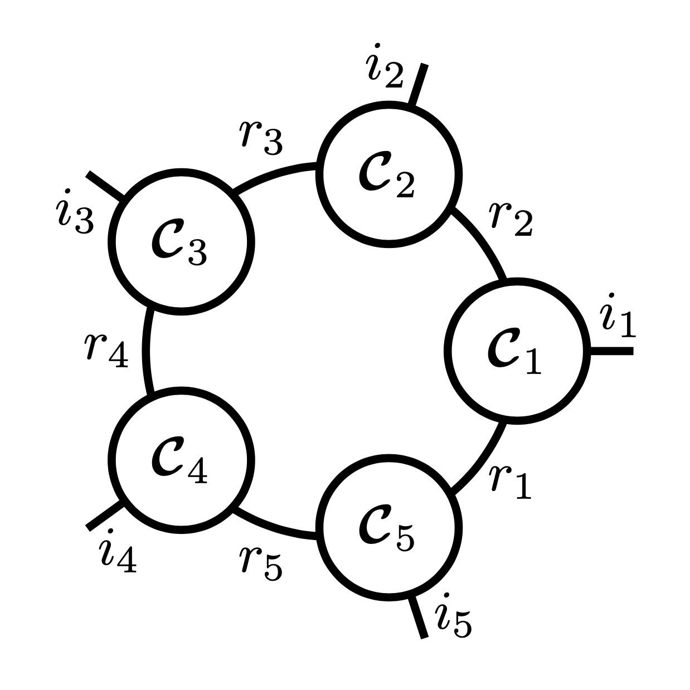

## T-Basis: a Compact Representation for Neural Networks 



This repository is the official implementation of our ICML 2020 paper titled "T-Basis: a Compact Representation for 
Neural Networks" 
[[arXiv]](https://arxiv.org/abs/2007.06631) 
[[PMLR]](http://proceedings.mlr.press/v119/obukhov20a.html). 

It demonstrates how to perform low-rank neural network training in a compressed form. 
The code provides select experiments (image classification and semantic segmentation) from the paper (see 
`configs/icml20` directory).

## Installation and Datasets

Clone the repository, then create a new virtual environment, and install python dependencies into it:
```bash
python3 -m venv venv_tbasis
source venv_tbasis/bin/activate
pip3 install --upgrade pip
pip3 install -r requirements.txt
```

In case of problems with generic requirements, fall back to 
[requirements_reproducibility.txt](doc/requirements_reproducibility.txt).

## Logging

The code performs logging to the console, tensorboard file in the experiment log directory, and also Weights and Biases 
(wandb). Upon the first run, please enter your wandb credentials, which can be obtained by registering a free account 
with the service.

## Creating Environment Config

The training script allows specifying multiple `yml` config files, which will be concatenated during execution. 
This is done to separate experiment configs from environment configs. 
To start running experiments, create your own config file with a few environment settings, similar to 
[configs/env_lsf.yml](configs/env_lsf.yml). Generally, you only need to update paths; see other fields explained in 
[config reference](doc/config.md).

## Training

Choose a preconfigured experiment from any of the `configs/icml20/*` directories, or compose your own config 
using the [config reference](doc/config.md), and run the following command:

```shell
CUDA_VISIBLE_DEVICES=0 python -m src.train --cfg configs/env_yours.yml --cfg configs/experiment.yml
```

## Citation

Please cite our work if you found it useful:

```
@InProceedings{obukhov2020tbasis,
  title={T-Basis: a Compact Representation for Neural Networks},
  author={Obukhov, Anton and Rakhuba, Maxim and Georgoulis, Stamatios and Kanakis, Menelaos and Dai, Dengxin and Van Gool, Luc},
  booktitle={Proceedings of the 37th International Conference on Machine Learning},
  pages={7392--7404},
  year={2020},
  editor={Hal Daumé III and Aarti Singh},
  volume={119},
  series={Proceedings of Machine Learning Research},
  month={13--18 Jul},
  publisher={PMLR},
  pdf={http://proceedings.mlr.press/v119/obukhov20a/obukhov20a.pdf},
  url={http://proceedings.mlr.press/v119/obukhov20a.html}
}
```

## License
This software is released under a CC-BY-NC 4.0 license, which allows personal and research use only. For a commercial 
license, please contact the authors. You can view a license summary here.

Portions of source code taken from external sources are annotated with links to original files and their corresponding 
licenses.

## Acknowledgements
This work was supported by Toyota Motor Europe and was carried out at the TRACE Lab at ETH Zurich (Toyota Research on 
Automated Cars in Europe - Zurich).
